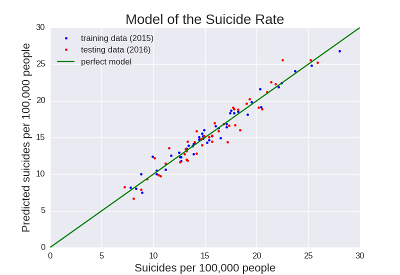

# SuicidePredictor

A model to predict suicide rates from people's environmental, bahavioral, and health data.

To download the data, run the ipython notebook download_data.ipynb.
To analyze the data, run model_data.ipynb.
  * build a multi-variable linear regression model using state-by-state data
  * predict suicide rate per state
  * predict suicide rate per county
To only make the plots, run plot_model.ipynb and plot_map_predictions.ipynb (requires the files model_data.pkl and data_county_map.pkl generated by model_data.ipynb).

The py files can be ignored as they were used for development only.
